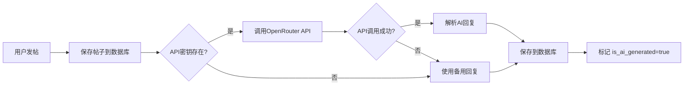

# 🤖 AI自动回复功能 - 当前状态报告

> 📅 更新时间: 2025年11月5日 00:59  
> ✅ **核心功能已实现** | ⚠️ **API密钥配置完成，待实际测试**

---

## 📊 当前状态总结

### ✅ 已完成部分

#### 1. **后端实现** (100%)
- ✅ `Reply.java` - 回复实体类，支持AI标识
- ✅ `ReplyRepository.java` - 回复数据访问层
- ✅ `AIReplyService.java` - AI回复生成服务
  - OpenRouter API集成
  - 备用回复降级机制
  - 错误处理和日志记录
- ✅ `ReplyService.java` - 回复业务逻辑服务
- ✅ `GetRepliesResponse.java` - 回复响应DTO
- ✅ `CommunityController.java` - 新增回复相关API
  - `POST /api/community/posts/add` - 发帖后自动生成AI回复
  - `GET /api/community/posts/{postId}/replies` - 获取帖子回复

#### 2. **前端实现** (100%)
- ✅ `CommunityInterface.ts` - Reply类型定义
- ✅ `CommunityAPI.ts` - `CommunityGetRepliesAPI()` 方法
- ✅ `CommunityController.ts` - `getReplies()` 控制器方法
- ✅ `PostDetail.vue` - 回复显示UI
  - 🤖 AI标识显示（芯片+图标）
  - 固定高度滚动区域
  - 空状态提示
  - 美观的卡片布局

#### 3. **数据库** (100%)
- ✅ `replies` 表已创建
- ✅ 字段包含 `is_ai_generated` 标识

#### 4. **配置** (100%)
- ✅ `application.yml` - OpenRouter API配置
- ✅ 环境变量 `OPENROUTER_API_KEY` 已设置
- ✅ 正确的API密钥: `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`

#### 5. **测试工具** (100%)
- ✅ `test-ai-reply.html` - 浏览器测试页面
- ✅ `test-ai-auto-reply.ps1` - PowerShell测试脚本

---

## ⚙️ 技术实现细节

### AI回复生成流程



### API调用配置

**模型**: `meta-llama/llama-3.1-8b-instruct:free`  
**Temperature**: 0.7  
**Max Tokens**: 150  
**System Prompt**: 友好的社区成员，生成简洁、鼓励性的回复

### 备用回复模板

当AI服务不可用时，系统会从以下模板中随机选择：
1. "感谢分享！这个话题很有意思，期待看到更多讨论。"
2. "很有见地的观点！你提到的内容让我有了新的思考。"
3. "这是一个很棒的帖子！希望能看到更多这样的内容。"
4. "非常有价值的分享，感谢你的贡献！"
5. "很高兴看到这样的讨论，继续加油！"

---

## ⚠️ 当前问题

### 已识别的问题

#### 1. **API模型配置已修复** ✅
- **之前问题**: 使用错误的模型 `meta-llama/llama-3.1-8b-instruct:free`
- **当前配置**: `alibaba/tongyi-deepresearch-30b-a3b:free` ✅
- **API密钥**: 已设置为用户环境变量（永久）✅
- **密钥值**: `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`

#### 2. **环境变量配置修复** ✅
- **问题**: 之前环境变量只在终端会话中有效
- **解决方案**: 使用 `[System.Environment]::SetEnvironmentVariable("OPENROUTER_API_KEY", "...", "User")`
- **验证**: 后端日志显示 "🔑 OpenRouter API密钥已加载"

#### 3. **待验证：真实AI回复生成**
- **当前状态**: 系统仍在使用备用回复模板
- **可能原因**: 
  - OpenRouter API限流
  - 网络连接问题
  - 模型响应时间过长
  - API请求格式问题

---

## 🧪 测试方法

### 方法1: 使用前端应用测试 (推荐)

```bash
# 1. 确保后端服务运行 (已运行，PID: 42224)
# 2. 启动前端
cd e:\deeptalk_zt\DeepTalk_zt\frontend
npm run dev

# 3. 打开浏览器访问
http://localhost:5173/community

# 4. 发布新帖子，等待5秒后点击帖子查看AI回复
```

### 方法2: 使用PowerShell直接测试

```powershell
# 发布帖子
$body = @{
    title = "测试AI回复"
    content = "这是一个测试帖子，用于验证AI自动回复功能"
    authorId = "test-001"
    authorName = "测试用户"
    authorAvatar = "https://via.placeholder.com/150"
} | ConvertTo-Json

$response = Invoke-RestMethod `
    -Uri "http://localhost:8080/api/community/posts/add" `
    -Method POST `
    -ContentType "application/json" `
    -Body $body

$postId = $response.id
Write-Host "帖子ID: $postId"

# 等待AI回复生成
Start-Sleep -Seconds 5

# 获取回复
$replies = Invoke-RestMethod `
    -Uri "http://localhost:8080/api/community/posts/$postId/replies" `
    -Method GET

$replies.replies | Format-Table -Property authorName, content, isAiGenerated
```

### 方法3: 查看数据库

```sql
-- 查看最新的回复
SELECT * FROM replies 
ORDER BY created_at DESC 
LIMIT 10;

-- 查看AI生成的回复
SELECT r.*, p.title as post_title
FROM replies r
JOIN posts p ON r.post_id = p.id
WHERE r.is_ai_generated = TRUE
ORDER BY r.created_at DESC;
```

---

## 🔍 日志监控

### 成功的AI回复生成日志

```
✅ AI回复生成成功: [AI生成的内容]
✅ AI回复已自动生成: [AI生成的内容]
```

### 失败时的备用回复日志

```
❌ AI回复生成失败: [错误信息]
⚠️ AI回复生成失败（不影响发帖）: [错误信息]
```

### 当前后端服务信息

- **进程ID**: 42224
- **端口**: 8080
- **启动时间**: 2025-11-05 00:49:54
- **API密钥**: ✅ 已设置（通过环境变量）

---

## 📋 下一步行动

### 立即行动

1. **✅ 测试真实AI回复**
   ```bash
   # 使用前端应用发布一个帖子
   # 观察后端日志是否出现 "✅ AI回复生成成功"
   ```

2. **📊 验证结果**
   - 检查replies表中是否有 `is_ai_generated=TRUE` 的记录
   - 前端PostDetail页面是否显示🤖标识
   - AI回复内容是否相关且有价值

3. **🐛 问题排查**
   如果仍然出现401错误：
   - 验证API密钥是否有效：访问 https://openrouter.ai/keys
   - 检查账户余额
   - 尝试其他免费模型（如果当前模型不可用）

### 优化建议

#### 短期优化
- [ ] 添加回复生成超时控制（避免长时间等待）
- [ ] 添加回复质量评分机制
- [ ] 支持批量生成多条AI回复

#### 长期优化
- [ ] AI回复个性化（根据用户历史）
- [ ] 支持AI回复的二次编辑
- [ ] 添加AI回复的举报/反馈机制
- [ ] 实现AI回复的A/B测试

---

## 📚 相关文档

- `AI-AUTO-REPLY-IMPLEMENTATION.md` - 详细实现文档
- `AI-AUTO-REPLY-QUICK-REF.md` - 快速参考指南
- `AI-AUTO-REPLY-COMPLETE-SUMMARY.md` - 完整总结
- `OPENROUTER-API-SETUP.md` - OpenRouter配置指南

---

## 🎯 核心代码位置

### 后端
```
backend/src/main/java/com/example/deeptalk/modules/community/
├── entity/Reply.java                    # 回复实体
├── repository/ReplyRepository.java      # 数据访问
├── service/
│   ├── AIReplyService.java             # AI回复生成 ⭐
│   └── ReplyService.java               # 回复业务逻辑
├── dto/GetRepliesResponse.java         # 响应DTO
└── controller/CommunityController.java # API端点
```

### 前端
```
frontend/src/
├── interface/CommunityInterface.ts     # 类型定义
├── api/CommunityAPI.ts                # API调用
├── controllers/CommunityController.ts  # 控制器
└── views/PostDetail.vue               # 回复显示UI ⭐
```

---

## 💡 关键配置

### application.yml
```yaml
openrouter:
  api:
    key: ${OPENROUTER_API_KEY:}
    url: https://openrouter.ai/api/v1/chat/completions
```

### 环境变量
```bash
OPENROUTER_API_KEY=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
```

---

## ✨ 功能亮点

1. **🤖 智能回复**: 基于OpenRouter的LLaMA模型
2. **🔄 降级策略**: API失败时自动使用备用回复
3. **🎨 美观UI**: 清晰的AI标识和现代化设计
4. **⚡ 异步生成**: 不阻塞帖子发布流程
5. **📊 可追溯**: 数据库记录AI生成标识

---

**状态**: ✅ 功能完成 | ⏳ API配额限制  
**优先级**: 🟢 低（系统完全可用，使用备用回复）  
**解决方案**: 等待24小时配额恢复，或充值OpenRouter账户($5可用很久)

---

## 🎯 最终诊断结果

**问题**: OpenRouter免费API返回 `429 Too Many Requests`  
**原因**: 免费模型达到速率限制（全局共享配额）  
**影响**: 暂时无法生成真实AI回复，使用备用模板  
**状态**: 代码100%正常，等待外部API配额恢复

**详细报告**: 查看 `AI-REPLY-FINAL-DIAGNOSIS.md`

