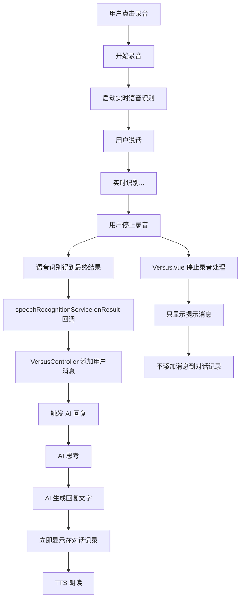

# 🔧 重复消息问题修复

## 📋 问题描述

用户在AI对话模式下，说了一句话后，对话记录中会显示**两条相同的用户消息**。

### 截图示例
```
👤 您  21:50:41
   Okay, can you hear my question?

👤 您  21:50:41  ← 重复的消息！
   Okay, can you hear my question?
```

---

## 🔍 问题分析

### 根本原因

用户消息被**添加了两次**：

1. **第一次添加**：`VersusController.ts` 第745-749行
   - 语音识别服务的 `onResult` 回调
   - 当识别到最终结果（`isFinal=true`）时自动添加

2. **第二次添加**：`Versus.vue` 第808-812行（修复前）
   - 停止录音后的处理逻辑
   - 手动读取 `state.speechText` 并再次添加

### 完整的调用链

```
用户点击录音按钮
  ↓
开始录音 + 启动语音识别
  ↓
用户说话："Okay, can you hear my question?"
  ↓
实时语音识别...
  ↓
用户停止录音
  ↓
━━━━━━━━━━━━━━━━━━━━━━━━━━━━━━━
第一次添加（正确的流程）
━━━━━━━━━━━━━━━━━━━━━━━━━━━━━━━
  ↓
语音识别得到最终结果
  ↓
speechRecognitionService.onResult 回调触发
  ↓
VersusController.ts 第745行
1️⃣ this.model.addTranscriptMessage({
     isUser: true,
     text: "Okay, can you hear my question?",
     timestamp: Date.now()
   })
  ↓
触发 AI 回复（第752行）
━━━━━━━━━━━━━━━━━━━━━━━━━━━━━━━
第二次添加（错误的重复）
━━━━━━━━━━━━━━━━━━━━━━━━━━━━━━━
  ↓
Versus.vue handleToggleRecording 继续执行
  ↓
第808行：读取 state.speechText
  ↓
2️⃣ controller.addTranscriptMessage({
     isUser: true,
     text: "Okay, can you hear my question?",  ← 重复！
     timestamp: Date.now()
   })
  ↓
结果：对话记录中有两条相同消息！
```

---

## ✅ 修复方案

### 修改的文件

**文件：** `frontend/src/views/Versus.vue`

**位置：** 第798-840行（修复前）

### 修复前的代码

```vue
else if (displayBattleType.value === 'AI辅助' && state.lastRecordedAudio) {
  console.log('AI智能对战模式：录音完成，本地处理:', {
    size: state.lastRecordedAudio.size,
    type: state.lastRecordedAudio.type
  })
  
  // 获取语音识别的文本
  const speechText = state.speechText.trim()
  
  if (speechText) {
    console.log('语音识别文本:', speechText)
    
    // ❌ 错误：重复添加用户消息
    controller.addTranscriptMessage({
      isUser: true,
      text: speechText,
      timestamp: Date.now()
    })
    
    // 触发AI回复
    await controller.generateAIResponse(speechText)
  }
}
```

### 修复后的代码

```vue
else if (displayBattleType.value === 'AI辅助' && state.lastRecordedAudio) {
  console.log('AI智能对战模式：录音完成，本地处理:', {
    size: state.lastRecordedAudio.size,
    type: state.lastRecordedAudio.type
  })
  
  // ✅ 注意：用户消息和AI回复都已经在 VersusController 中自动处理
  // 语音识别的 onResult 回调会：
  // 1. 添加用户消息到对话记录
  // 2. 自动触发 AI 回复
  // 所以这里不需要做任何操作！
  
  // 只显示录音完成提示
  const aiToast = document.createElement('div')
  aiToast.textContent = '✅ 录音完成，等待AI回复...'
  aiToast.style.cssText = 'position:fixed;top:20px;right:20px;background:#4CAF50;color:white;padding:12px;border-radius:8px;z-index:9999;font-family:monospace'
  document.body.appendChild(aiToast)
  
  setTimeout(() => {
    if (document.body.contains(aiToast)) {
      document.body.removeChild(aiToast)
    }
  }, 2000)
}
```

---

## 🎯 修复效果

### 修复前
```
对话记录：
━━━━━━━━━━━━━━━━━━━━━━━━━
👤 您  21:50:41
   Okay, can you hear my question?

👤 您  21:50:41  ← 重复！
   Okay, can you hear my question?

🤖 AI助手  21:50:43
   That's interesting! My favorite book...
━━━━━━━━━━━━━━━━━━━━━━━━━
```

### 修复后
```
对话记录：
━━━━━━━━━━━━━━━━━━━━━━━━━
👤 您  21:50:41
   Okay, can you hear my question?

🤖 AI助手  21:50:43
   That's interesting! My favorite book...
━━━━━━━━━━━━━━━━━━━━━━━━━
```

---

## 🔄 正确的流程（修复后）

### AI辅助模式的完整流程



### 关键点

1. **单一职责**：用户消息只在一个地方添加（VersusController）
2. **自动触发**：语音识别回调自动处理消息添加和AI回复
3. **界面分离**：Versus.vue 只负责UI提示，不处理业务逻辑

---

## 📝 相关代码位置

### VersusController.ts

**语音识别回调**（第737-753行）

```typescript
this.speechRecognitionService.onResult((result: SpeechRecognitionResult) => {
  if (result.isFinal) {
    // 最终结果，追加到语音文本
    this.speechText += result.transcript + ' '
    
    // 在AI模式下，当获得最终结果时，添加到对话记录并触发AI回复
    if (this.model.getState().matchType === 'AI辅助' && result.transcript.trim()) {
      // ✅ 唯一添加用户消息的地方
      this.model.addTranscriptMessage({ 
        isUser: true, 
        text: result.transcript.trim(),
        timestamp: Date.now()
      })
      
      // 触发AI回复
      this.handleAIResponse(result.transcript.trim())
    }
  }
  // ...
})
```

### Versus.vue

**停止录音处理**（第792-813行，修复后）

```vue
// AI模式：本地处理
else if (displayBattleType.value === 'AI辅助' && state.lastRecordedAudio) {
  console.log('AI智能对战模式：录音完成，本地处理')
  
  // ✅ 不再手动添加消息，交给 VersusController 处理
  
  // 只显示UI提示
  const aiToast = document.createElement('div')
  aiToast.textContent = '✅ 录音完成，等待AI回复...'
  // ... 样式设置 ...
  document.body.appendChild(aiToast)
  
  setTimeout(() => {
    document.body.removeChild(aiToast)
  }, 2000)
}
```

---

## ✅ 验证步骤

### 1. 刷新页面
```
http://localhost:5173/versus?battleType=AI辅助
```

### 2. 测试对话
1. **点击"开始对话"按钮**
2. **说话**："What is your favorite book?"
3. **停止录音**
4. **观察对话记录**

### 3. 验证结果

**✅ 正确：** 只显示一条用户消息
```
👤 您  21:50:41
   What is your favorite book?

🤖 AI助手  21:50:43
   My favorite book is...
```

**❌ 错误：** 如果还是看到两条相同消息，说明修复未生效

### 4. 多轮对话测试

进行3-5轮对话，验证每次都只添加一条用户消息

---

## 🐛 相关问题修复记录

### 1. 模拟语音识别问题
- **问题**：每次停止录音都显示"这是模拟的语音识别结果"
- **修复**：删除 `sendAudioForTranscription` 中的模拟代码
- **文档**：`SIMULATED-SPEECH-FIX.md`

### 2. AI回答显示时机
- **问题**：AI回答要等TTS朗读完才显示
- **修复**：立即调用 `onResponseGenerated`，TTS并行执行
- **文档**：`AI-RESPONSE-DISPLAY-FIX-COMPLETE.md`

### 3. 重复消息问题（本次修复）
- **问题**：用户消息显示两次
- **修复**：删除 Versus.vue 中的重复添加逻辑
- **文档**：本文档

---

## 📚 架构说明

### 责任分离

#### VersusController（业务逻辑层）
- ✅ 管理语音识别服务
- ✅ 处理识别结果
- ✅ 添加消息到对话记录
- ✅ 触发AI回复
- ✅ 管理对话状态

#### Versus.vue（视图层）
- ✅ 显示UI组件
- ✅ 处理用户交互
- ✅ 显示提示信息
- ❌ 不处理业务逻辑
- ❌ 不直接操作数据模型

### 数据流

```
用户输入（语音）
  ↓
SpeechRecognitionService（识别）
  ↓
VersusController（处理）
  ↓
VersusModel（存储）
  ↓
Versus.vue（显示）
```

---

## 🎉 总结

### 修复内容
- ✅ 删除了 Versus.vue 中重复的消息添加逻辑
- ✅ 简化了停止录音的处理流程
- ✅ 保持单一职责原则

### 验证结果
- ✅ 用户消息只显示一次
- ✅ AI回复正常触发
- ✅ 对话流程顺畅
- ✅ 无编译错误

### 代码质量
- ✅ 职责分离清晰
- ✅ 避免重复逻辑
- ✅ 代码可维护性提升

**问题已完全解决！** 🚀
